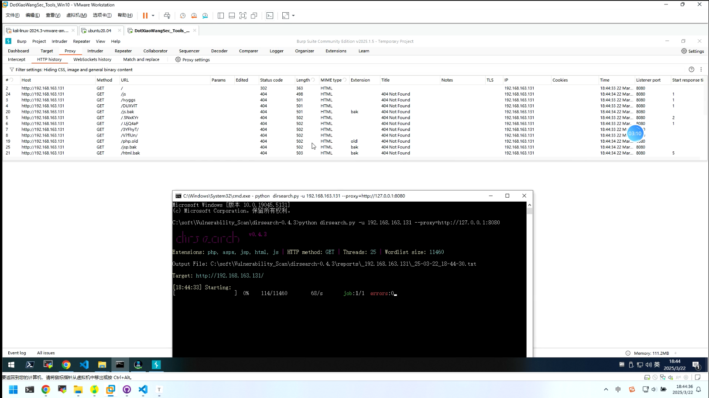
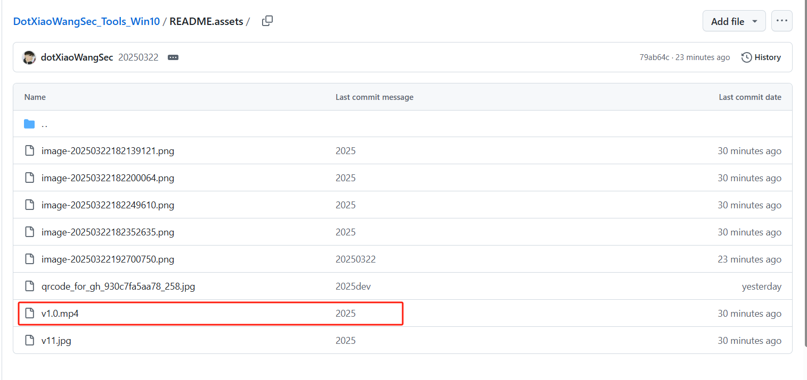
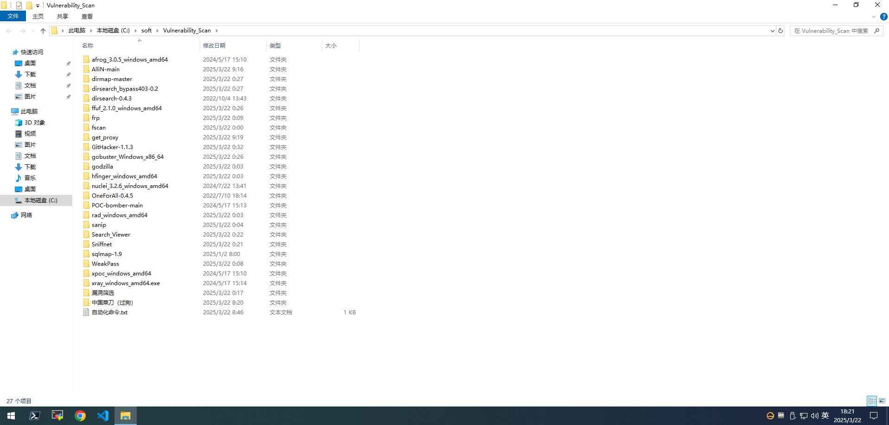
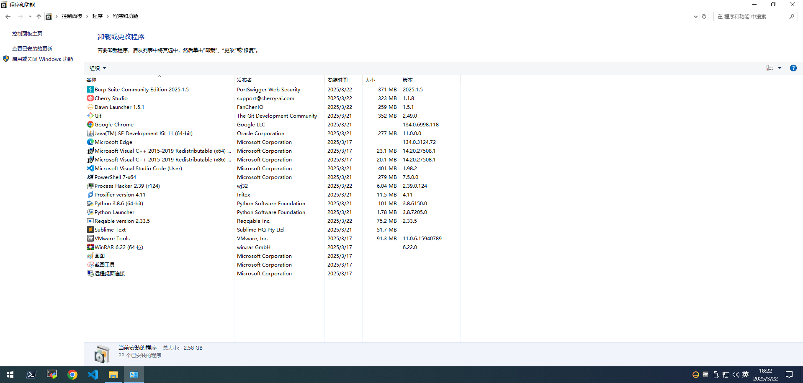
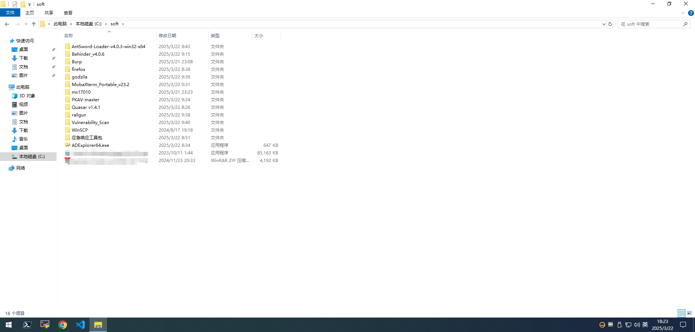
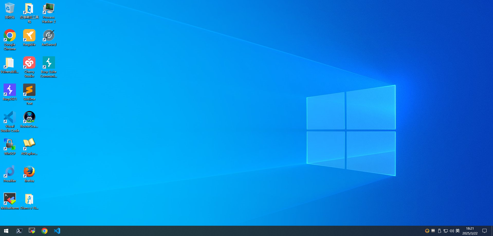

## 🚀	DotXiaoWangSec_Tools_Win10


## 1.DotXiaoWangSec武器库


​		DotXiaoWangSec武器库是一个开源的半自动化的渗透测试环境，主要集成了Web安全的自动化测试软件，环境已经配置好，可以拿来直接使用。请不要使用本工具做危害互联网安全事情，工具只是为了研究网络学习使用。出现任何法律问题和做着无关，请自行承担。谢谢。如果师傅们觉得不错进行二次开发非常欢迎。

对网络安全感兴趣的师傅可以关注我们的官网：https://www.xiaowang68.top  

微信公众号：DotXiaoWangSec

### 演示



演示视频在这里

 


## 2.虚拟机版本

​	建议虚拟机版本：VMware Workstation Pro 17.5

```html
		文件校验：
			大小: 13679423488 字节
			修改时间: 2025年3月22日, 19:44:23
			MD5: F8D3873BCC3F0327CE8A1A7DC09D900A
			SHA1: CFCD99E5FC9F4C97E0DE10ABCCC9D98133D35F14
			CRC32: A7D58187
```


​	百度网盘

```html
通过网盘分享的文件：dotXiaowangSec工具
链接: https://pan.baidu.com/s/1y-kq1Qz85RPZ47WTicrTxg?pwd=jyfr 
提取码: jyfr 
```


## 3.环境介绍

​	**使用必看：**



以上只是工具的冰山一角，后续还会陆续升级软件，敬请期待。





​	**系统截图：**




## 4.版本

2025年3月22日v1.0


## 5.客服


对本项目感兴趣的师傅可以进我们圈子。


## 6.免责声明


1. **工具来源**: 我们的网络安全工具集合系统中的大部分工具来源于互联网，我们尽力确保这些工具的准确性和可靠性，但不对其准确性、完整性或实用性提供任何明示或暗示的担保。 
2. **使用风险**: 用户理解并同意，使用这些工具存在一定风险，包括但不限于信息泄露、数据丢失、系统受损等。 用户应自行承担使用这些工具可能带来的任何风险，并独立评估工具的适用性和安全性。 
3. **免责声明**: 我们不对用户使用这些工具所产生的任何直接或间接损失或损害承担任何责任。 我们不对用户在使用这些工具时可能遇到的任何法律责任承担责任。 
4. **法律遵守**: 用户在使用这些工具时应遵守当地法律法规，不得将这些工具用于任何非法目的。 用户应自行承担因违反法律法规而产生的任何法律责任。 
5. 变更和更新: 我们保留随时更改或更新这些免责声明的权利。用户在使用我们的工具之前应定期查看此免责声明。
6.  **接受条款**: 使用我们的网络安全工具集合系统将被视为接受此免责声明的全部条款和条件。 通过使用我们的网络安全工具集合系统，即表示您已阅读、理解并接受了本免责声明的所有条款和条件。如果您不同意这些条款，请不要使用我们的系统。谢谢！！


